<p align="center">
  
</p>

<p align="center">
  
</p>

<h1 align="center">ISA — Integrated Stack Analyzer</h1>

<p align="center">
  
  
  
  
  
</p>

<p align="center">
  A Chrome extension (Manifest V3) for <b>evidence-based</b> technology fingerprinting<br/>
  and version enumeration — think Wappalyzer / WhatWeb, but <b>better</b>.
</p>

<p align="center">
  
</p>

<p align="center">
  
</p>

<br/>

##  Table of contents

- [What ISA is](#what-isa-is)
- [Feature overview](#feature-overview)
- [Live snapshot](#live-snapshot)
- [Screenshots](#screenshots)
- [Installation](#installation)
- [Usage](#usage)
- [Permissions — what's requested, and why](#permissions--whats-requested-and-why)
- [Detection engine — how it works](#detection-engine--how-it-works)
- [Evidence sources currently wired up](#evidence-sources-currently-wired-up)
- [The `verified` flag](#the-verified-flag)
- [Extending the ruleset](#extending-the-ruleset)
- [Project layout — every file, explained](#project-layout--every-file-explained)
- [CVE, KEV &amp; exploit-intel correlation](#cve-kev--exploit-intel-correlation)
- [Security-header grading &amp; unified risk score](#security-header-grading--unified-risk-score)
- [Opt-in exposure checks](#opt-in-exposure-checks)
- [Scan history &amp; export](#scan-history--export)
- [Custom rule editor](#custom-rule-editor)
- [Testing &amp; verification — four independent layers](#testing--verification--four-independent-layers)
- [Accuracy audit — known false-positive classes](#accuracy-audit--known-false-positive-classes)
- [Privacy &amp; permissions in depth](#privacy--permissions-in-depth)
- [Build &amp; packaging](#build--packaging)
- [Publishing to the Chrome Web Store](#publishing-to-the-chrome-web-store)
- [Roadmap &amp; development history](#roadmap--development-history)
- [Honesty section: limits &amp; not-yet-tested](#honesty-section-limits--not-yet-tested)
- [Contributing](#contributing)
- [License](#license)

<p align="center"></p>

## What ISA is

**ISA (Integrated Stack Analyzer)** is a browser-based recon tool built for
**authorized** penetration tests and bug-bounty engagements. It watches a
page the way a careful human analyst would — headers, cookies, meta tags,
script sources, CSS custom properties, CSP allow-lists, live JS globals, and
outbound API calls — and turns what it sees into a fingerprint you can
actually trust, because **every single line of output is backed by the raw
evidence string that produced it.**

That single design choice — evidence over inference — is what separates ISA
from a simple "here's a logo and a guess" fingerprinting tool. Where
Wappalyzer or WhatWeb will tell you *what* they think a site runs, ISA also
shows you *exactly why*: the literal header value, the literal cookie name,
the literal regex capture group, the literal DOM selector that fired — so
you can hand-verify any finding in seconds instead of taking a black box's
word for it.

> **Only run this against targets you're authorized to test.** ISA is a
> magnifying glass, not a weapon — it never runs exploit code and never
> touches anything but the page it's pointed at (plus a small, named set of
> opt-in public threat-intel APIs you explicitly click to query).

<p align="center"></p>

<p align="center"></p>

## Feature overview

<table align="center"><tr>
<td></td>
<td></td>
</tr><tr>
<td></td>
<td></td>
</tr></table>

| Pillar | What it actually means in the UI |
|---|---|
| **Raw evidence** | Every finding comes with the exact matched header, cookie, meta tag, script path or DOM string — click to expand and verify it yourself. Nothing is ever summarized away from you. |
| **Confidence score** | The sum of every independent signal that actually matched, capped at 100. No category guesswork — a technology only appears if at least one real signal fired. |
| **CVE correlation** | Detected `technology + exact version` pairs are checked against a local advisory table, then optionally against NVD, OSV.dev, GHSA, CISA KEV and FIRST.org EPSS — five independent correlation sources. |
| **Security posture** | Response headers are graded A–F (CSP, HSTS, X-Content-Type-Options, frame-ancestors, Referrer-Policy, Permissions-Policy, cookie flags), rolled into one 0–100 risk score alongside CVE and exposure findings. |
| **Opt-in active checks** | `.git`/`.env` exposure, source maps, verbose debug pages, directory listings, `security.txt`, `robots.txt`/`sitemap.xml`, and GraphQL introspection — all behind explicit buttons, never automatic. |
| **Recon-first design** | Read-only by default. Every network call beyond the target page itself is opt-in, narrow, and documented in `PRIVACY.md`. |
| **CI-friendly exports** | JSON, CSV, Markdown, and SARIF 2.1.0 (native to GitHub Code Scanning, GitLab, Azure DevOps). |
| **Custom rules** | A full form-based editor for every signal type the engine supports — no hand-written JSON required to extend coverage beyond the built-in ruleset. |

<p align="center"></p>

## Live snapshot

This is what a completed scan looks like — findings, evidence, and severity,
all in one popup:

<p align="center"></p>

<p align="center">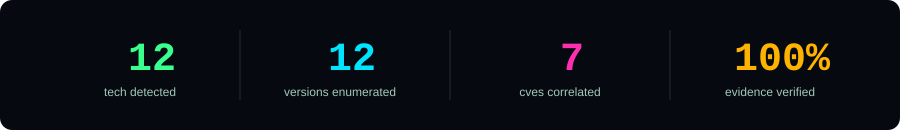</p>

<p align="center">
  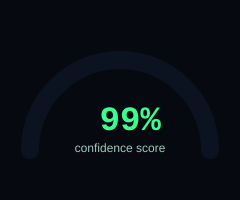
  
  
</p>

<p align="center"></p>

## Screenshots

Real captures from a real Chromium instance running against real scan data
(via `tools/screenshot-ui.py`) — not mockups.

<table align="center">
<tr>
<td align="center" width="50%">
  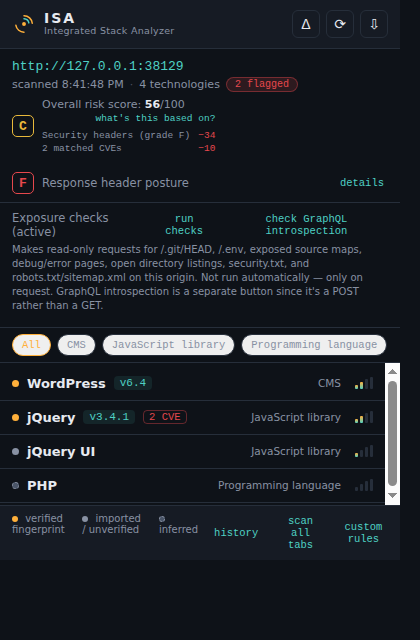<br/>
  <sub><b>Popup — findings list</b><br/>Risk score, header grade, exposure checks, and every detected technology with its confidence bars.</sub>
</td>
<td align="center" width="50%">
  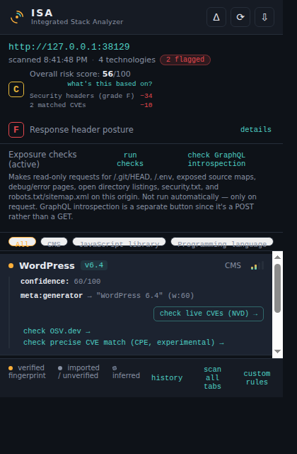<br/>
  <sub><b>Popup — evidence expanded</b><br/>WordPress finding opened up: the exact <code>meta:generator</code> match, confidence math, and per-finding CVE lookup buttons.</sub>
</td>
</tr>
<tr>
<td align="center" width="50%">
  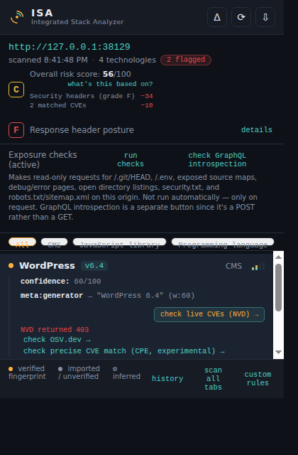<br/>
  <sub><b>Popup — live-lookup error state</b><br/>What "NVD returned 403" looks like in the real UI — a clear, specific error rather than a hang or a stack trace.</sub>
</td>
<td align="center" width="50%">
  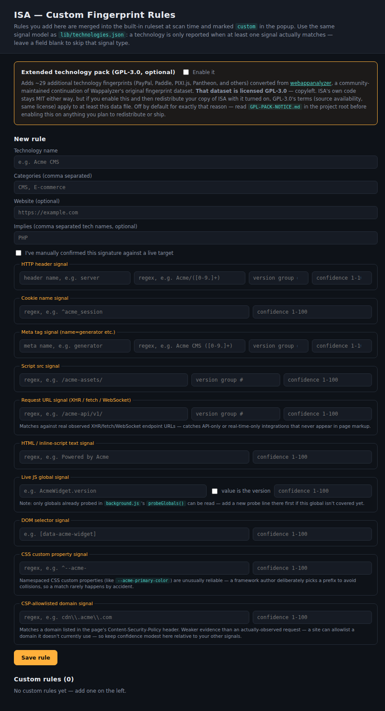<br/>
  <sub><b>Options — custom fingerprint rules</b><br/>Build your own signal-based rules (header, cookie, meta, script-src, requestUrl, global, DOM, CSS var, CSP domain) for anything outside the 188+ built-in technologies.</sub>
</td>
</tr>
<tr>
<td align="center" width="50%">
  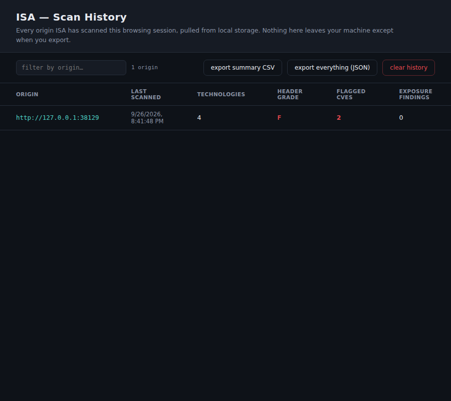<br/>
  <sub><b>Scan history</b><br/>Every origin ISA has scanned this session, local-only, exportable as CSV or full JSON.</sub>
</td>
<td align="center" width="50%">
  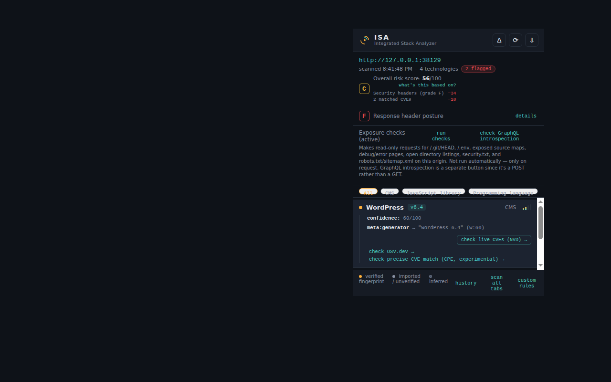<br/>
  <sub><b>Store-listing asset</b><br/>The popup at the exact 1280×800 size the Chrome Web Store requires for listing screenshots.</sub>
</td>
</tr>
</table>

<p align="center"></p>

## Installation


**Unpacked, for development:**

1. Open `chrome://extensions` → enable **Developer mode**.
2. Click **Load unpacked** → select the `isa-extension` folder.
3. Visit any site you're authorized to test, then click the ISA icon in the toolbar.

**Verifying it actually works, without needing a real target yet:**

```bash
node tools/serve-fixture.mjs
```

Then visit `http://localhost:8420/` with ISA loaded, open the popup, and
compare the output against `test-fixture/EXPECTED.md` — a synthetic page
that exercises nearly every signal type (headers, cookies, meta tags,
script sources, CSS custom properties, CSP domains, inline HTML, and DOM
selectors) against a ground-truth result list generated by running the
*real* matcher — not hand-guessed. It can't exercise `globals` or
`requestUrl` signals, since those need a live JS runtime and live network
observation respectively; `EXPECTED.md` says so explicitly and names
exactly which fixture technologies it under-reports for that reason. This
is a good first check before moving to real (authorized) targets;
`tests/browser-smoke.py` (see [Testing & verification](#testing--verification--four-independent-layers))
is the deeper real-Chromium check that covers what a static fixture can't.

<p align="center"></p>

## Usage


<p align="center">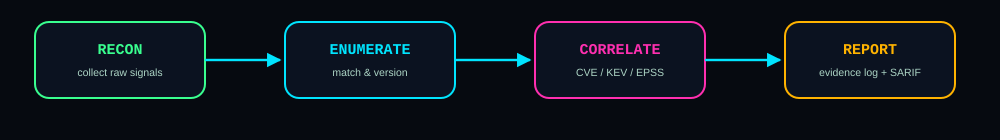</p>

1. **Recon** — load the target page with ISA active; the content script and
   background service worker begin collecting raw signals immediately and
   passively, the moment the page is idle. Nothing is sent anywhere yet.
2. **Enumerate** — `lib/matcher.js` turns matched signals into named
   technologies with an exact (or best-available) version string, computing
   a confidence score as the sum of every signal that actually fired.
3. **Correlate** — matched `technology + version` pairs are checked against
   the local `lib/vuln-db.json` table automatically, and — only if you
   click the relevant button — against up to five live public
   threat-intelligence feeds (NVD, OSV.dev, GHSA, CISA KEV, FIRST EPSS).
4. **Report** — review results in the popup, drill into the raw evidence
   behind any finding, check the unified 0–100 risk score and A–F header
   grade, optionally run exposure checks, then export as JSON, CSV,
   Markdown, or SARIF 2.1.0 for CI ingestion.

Two more entry points live in the popup footer: **history** (every origin
scanned this session — see [Scan history & export](#scan-history--export))
and **custom rules** (the options-page rule editor — see
[Custom rule editor](#custom-rule-editor)). A **scan all tabs** button
reloads every open tab whose origin hasn't already been scanned this
session, skipping any tab that already has results (`lib/bulk-scan.js`).

<p align="center"></p>

## Permissions — what's requested, and why


MV3 permissions are the first thing a careful reviewer (or a careful
security engineer deciding whether to load this at all) should check before
anything else. Every permission ISA requests maps to one concrete,
explainable capability — there is no permission requested "just in case."

| Permission | Why ISA needs it |
|---|---|
| `storage` | Persists scan results and custom rules locally via `chrome.storage.local`. Nothing here ever leaves your machine except when you explicitly export. |
| `scripting` | Runs the MAIN-world global probe (`chrome.scripting.executeScript({world:"MAIN"})`) that reads page-set values like `React.version` — content scripts alone can't see the page's own JS globals. |
| `tabs` | Needed to query the active tab's URL/origin and to drive "scan all tabs." |
| `cookies` | Reads cookie *names* (not values) via `chrome.cookies.getAll`, including HttpOnly cookies invisible to `document.cookie` — certain cookie-naming patterns (e.g. `laravel_session`) are reliable technology signals. |
| `webRequest` | Captures response headers (`onHeadersReceived`) and observed XHR/fetch/WebSocket endpoint URLs (`onBeforeRequest`) — the strongest evidence class, since it reflects what the page *actually does*, not just what its markup mentions. |
| `webNavigation` | Listens for `onHistoryStateUpdated` so single-page apps (React Router, Next.js, Vue Router) that change routes via `history.pushState` without a full reload still get re-scanned. |
| `downloads` | Powers the JSON/CSV/Markdown/SARIF export buttons. |
| `host_permissions: <all_urls>` | Required because ISA is a general-purpose recon tool for *any* site you point it at, not a fixed list of targets — this is the same permission shape every fingerprinting/dev-tools extension in this category needs. |

No `<all_urls>` content script runs any active/writing behavior — it only
*reads* what's already rendered. Nothing under this permission set enables
ISA to modify a page, inject content into it, or act on your behalf on any
site. See [Privacy & permissions in depth](#privacy--permissions-in-depth)
for the full, plain-language policy text, and `CWS_SUBMISSION.md` for the
exact justification strings submitted to Chrome Web Store review for each
one of these.

<p align="center"></p>

## Detection engine — how it works


Every technology entry in `lib/technologies.json` declares one or more
**signals**: an HTTP response-header regex, a cookie-name regex, a
`<meta name=generator>` pattern, a script-`src` path pattern, an
inline-HTML/comment pattern, a live `window.*` global read from the page's
own JS context, or a DOM selector/attribute. `lib/matcher.js` only reports a
technology when **at least one signal actually matched** — nothing is ever
inferred from category guesswork.

Each technology's overall **confidence** score is the sum of every signal
that matched (capped at 100), and the popup shows the exact matched string
behind every signal so you can hand-verify it yourself.

Version numbers are pulled from regex capture groups or read directly off a
live object (`jQuery.fn.jquery`, `React.version`, …) — never guessed from a
technology's mere presence.

<p align="center">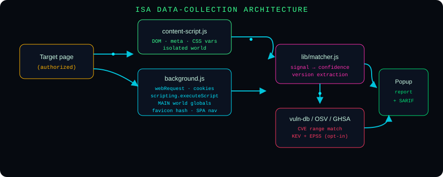</p>

### Evidence sources currently wired up

<p align="center">
  
  
  
  
  
  
  
  
</p>

| Source | Collected by | Notes |
|---|---|---|
| Response headers | `background.js` via `webRequest.onHeadersReceived` | `main_frame` only, incl. `extraHeaders` |
| Cookies (incl. HttpOnly) | `background.js` via `chrome.cookies.getAll` | merged with `document.cookie` names from the content script |
| `<meta>` tags, script `src` list, HTML/comment sample | `content-script.js` | isolated world, passive DOM read |
| Live JS globals (`React.version`, `jQuery.fn.jquery`, `Shopify.shop`, …) | `background.js` via `chrome.scripting.executeScript({world:"MAIN"})` | content scripts can't see page globals directly — this runs a probe in the page's own JS context |
| XHR / fetch / WebSocket endpoint URLs | `background.js` via `webRequest.onBeforeRequest` | captures real observed API/real-time calls as a `requestUrl` signal — stronger evidence than a static markup mention, and the only way to catch API-only or real-time-only integrations that never appear in page HTML |
| CSS custom properties | `content-script.js` via `document.styleSheets` (same-origin only) | Bootstrap 5+, Tailwind, Chakra UI, Ant Design, Mantine, Radix, Shoelace, Ionic namespace their CSS vars (`--bs-`, `--chakra-`, …), making this an unusually reliable signal — no unrelated stylesheet accidentally emits `--chakra-colors-blue-500` |
| CSP-allowlisted domains | `background.js`, parsed from `Content-Security-Policy` | weighted lower than `requestUrl`/`scriptSrc` — a domain a site *permits* isn't the same evidence as one it's *observed* calling |
| DOM selectors/attributes (`[ng-version]`, `[data-reactroot]`, …) | `content-script.js` | |
| Favicon hash (SHA-256) | `background.js` | matched against `lib/favicon-hashes.json` — table ships empty; see [Project layout](#project-layout--every-file-explained) |
| SPA route changes | `background.js` via `chrome.webNavigation.onHistoryStateUpdated` | `history.pushState`/`replaceState` navigations don't reload the document, so the content script wouldn't otherwise re-run — keeps ISA accurate as a single-page app navigates |

Worth being direct about: no fingerprinting tool, including this one, gets
to 100% detection accuracy. A site can strip or spoof headers, run a
heavily patched fork, sit behind a WAF that normalizes every response, or
minify away every version string a regex could catch. What actually moves
accuracy up is what this project does throughout — more independent,
corroborating signal types per technology (the confidence score reflects
exactly that), testing every rule against both a positive control and a
plausible false-positive scenario before it ships, and showing raw evidence
behind every finding so you can verify by hand rather than trust a number.
`lib/technologies.json` currently covers **188 named technologies**
(**217** with the optional GPL pack enabled) — real sites regularly run
things outside that list, which is what the custom rule editor is for.

<p align="center">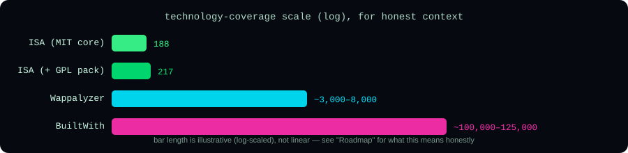</p>

### The `verified` flag

Every ruleset entry is tagged `"verified": true|false`. `true` means the
signature has been manually confirmed against a live target by this
project's maintainer; `false` means it was imported from public fingerprint
conventions but not yet independently re-confirmed here. The popup shows
this as an amber dot (verified), a grey dot (unverified/imported), or a
dashed dot (inferred via an `implies` relationship, e.g. WordPress implying
PHP) — so you always know how much to trust each line before relying on it.

Worth being direct about: as coverage has grown through bulk-sourced
batches, the fraction actually `verified: true` has necessarily fallen —
live verification against a real target doesn't scale the same way sourcing
a real, documented signal does. Run `node tools/verified-ratio.mjs` for the
current honest number rather than trusting a percentage hardcoded here,
since that number moves every time the ruleset grows. A `false` tag is
**not** a quality warning on its own — every entry, verified or not, still
goes through the same lint/self-consistency/regression-test pipeline before
shipping — it just means nobody has confirmed the *exact* live match yet,
so treat those findings with proportionally more of your own judgment.

<p align="center"></p>

## Extending the ruleset


Add an entry to `lib/technologies.json`:

```json
{
  "name": "Example CMS",
  "categories": ["CMS"],
  "verified": false,
  "implies": ["PHP"],
  "website": "https://example.com",
  "signals": {
    "headers": [{ "key": "x-example-cms", "regex": "v?([0-9.]+)", "version": 1, "confidence": 70 }],
    "meta": [{ "name": "generator", "regex": "Example CMS ([0-9.]+)", "version": 1, "confidence": 60 }],
    "scriptSrc": [{ "regex": "/example-assets/", "confidence": 35 }],
    "cookies": [{ "regex": "^examplecms_session", "confidence": 30 }],
    "globals": [{ "path": "ExampleCMS.version", "confidence": 85, "isVersionLike": true }],
    "dom": [{ "selector": "[data-example-cms]", "confidence": 20 }]
  }
}
```

- `version` on a `headers`/`meta`/`scriptSrc`/`html` rule is the regex
  capture-group index to use as the version string.
- `globals` rules key against **flat, literal dotted-string keys** produced
  by `probeGlobals()` in `background.js` — if you add a new global to check,
  add its probe line there first (globals can't be read generically for
  security/sandboxing reasons; each one is an explicit, reviewable read).
- Keep any single weak/generic signal (a common script path, a one-word
  cookie name) under ~40–50 confidence so it can't alone push a finding to
  "high confidence" — confidence should come from corroborating signals.
- Every rule you add is automatically covered by `tools/lint-rules.mjs` and
  `tools/self-consistency-check.mjs` the next time `build.sh` runs — see
  [Testing & verification](#testing--verification--four-independent-layers).
- If your rule is at meaningful risk of a false positive (a generic header,
  a short keyword), add a negative-control test case to `tests/run.mjs` —
  see [Accuracy audit](#accuracy-audit--known-false-positive-classes) for
  four real examples of exactly this kind of bug being caught this way.

<p align="center"></p>

## Project layout — every file, explained


```
manifest.json          MV3 manifest
background.js          service worker: header/cookie capture, global probing, matcher orchestration, storage
content-script.js      isolated-world DOM/meta/script/comment collection
lib/matcher.js          the detection engine (pure functions, unit-testable with plain node)
lib/technologies.json   fingerprint ruleset (188 entries, MIT)
lib/vuln-db.json        informational CVE correlation table
lib/live-cve-lookup.js  opt-in live NVD query
lib/kev-lookup.js       opt-in CISA KEV cross-reference — confirms a CVE is actively exploited in the wild
lib/epss-lookup.js      opt-in FIRST.org EPSS score lookup — 30-day exploitation-probability, for prioritization
lib/ghsa-lookup.js      opt-in GitHub Security Advisories cross-reference — third correlation source alongside NVD/KEV/EPSS
lib/osv-lookup.js       opt-in OSV.dev lookup — queries by package+version rather than CVE ID, surfaces vulnerabilities for any versioned technology with a verified package mapping (27 as of this writing)
lib/cpe-lookup.js       opt-in precise CPE-based NVD matching for 6 individually-verified technologies — experimental, see the file's own honesty note
lib/bulk-scan.js        pure tab-selection logic for "scan all tabs" — reloads only unscanned-origin tabs, never touches one that already has results
lib/risk-score.js       pure function combining header grade + CVE matches + exposure findings into one 0-100 score
lib/sarif-export.js     SARIF 2.1.0 export for CI ingestion (GitHub Code Scanning, GitLab, Azure DevOps)
lib/exploit-links.js    builds deep links to NVD/MITRE/Exploit-DB/GitHub Advisories — links only, never exploit content
lib/technologies-gpl-extended.json  opt-in GPL-3.0 pack, off by default — see GPL-PACK-NOTICE.md
GPL-PACK-NOTICE.md      what enabling/redistributing the GPL pack actually obligates
lib/security-headers.js response-header grading (CSP/HSTS/etc. → A-F)
lib/exposure-checks.js  opt-in active checks: .git/.env exposure, source maps, dependency manifests, verbose debug/error pages, directory listings, security.txt, robots.txt/sitemap.xml, GraphQL introspection
lib/favicon-hashes.json favicon SHA-256 → tool lookup table (ships empty — see tools/README.md)
tools/hash-favicon.mjs  CLI to populate favicon-hashes.json from real sources
tools/lint-rules.mjs    ruleset static analysis — ERROR/WARN checks, wired into build.sh
tools/self-consistency-check.mjs  derives a real example from every regex signal, round-trips it through the actual matcher, wired into build.sh
tools/verify-package.mjs  confirms manifest/HTML/getURL/icon references actually resolve — would the extension load in Chrome at all, wired into build.sh
tools/verified-ratio.mjs  reports the ruleset's verified:true ratio — read-only, not wired into build.sh
tools/serve-fixture.mjs  serves test-fixture/index.html for manual comparison, and (--write-expected) regenerates test-fixture/EXPECTED.md from the real matcher
tools/screenshot-ui.py  drives the real extension in real Chromium and screenshots popup/options/history for documentation
test-fixture/           synthetic fixture page + generated ground-truth findings
tests/run.mjs           regression suite — no dependencies, run with `node tests/run.mjs`
tests/browser-smoke.py  real-Chromium end-to-end check via Playwright
build.sh                lints + self-consistency-checks + verifies package + tests + packages to dist/isa-extension.zip, refuses to build on failure
CWS_SUBMISSION.md       Chrome Web Store submission checklist and permission justifications
popup/                  popup UI (results list, filters, evidence drill-down, export incl. SARIF, security grade, unified risk score, exposure checks, diff view)
options/                custom rule editor (options page) — CRUD for user-defined fingerprint signals
history/                scan history page — every origin scanned this session, sortable/searchable, with bulk export
```

<p align="center"></p>

## CVE, KEV &amp; exploit-intel correlation


<p align="center">
  
  
  
  
</p>

`lib/vuln-db.json` is a small, informational-only table mapping a detected
technology + exact version against public CVE advisories. It contains **no
exploit code** — only advisory IDs, severity, and a one-line summary — and
exists purely to help you prioritize what's worth manually verifying.
Matching is real version-range comparison (`versionInRange` /
`compareVersions` in `lib/matcher.js`), not a name match — a patched version
correctly shows zero CVEs from this table.

**Confirming exploitation status (opt-in): CISA KEV + EPSS.** A version
falling in a CVE's affected range tells you it's *theoretically* vulnerable —
it says nothing about whether that vulnerability is actually being exploited
anywhere. The **"confirm exploitation status"** button cross-references
matched CVE IDs against:

- **CISA's Known Exploited Vulnerabilities catalog** — the US government's
  authoritative, continuously-updated list of CVEs *confirmed* to be
  actively exploited in the wild, including ransomware-campaign usage and
  CISA's remediation due date.
- **FIRST.org's EPSS** — a daily-updated statistical probability (0–100%)
  that a given CVE will be exploited in the next 30 days, with a percentile
  rank against every other scored CVE. This is the complementary signal for
  CVEs that aren't (yet) KEV-confirmed: a medium-severity CVE with a high
  EPSS score can be a more urgent fix than a critical-severity one with a
  near-zero score.

**Live CVE lookup (opt-in).** Each finding with a version has a **"check
live CVEs (NVD)"** button that queries NIST's public National Vulnerability
Database for that exact technology + version and shows current CVE IDs,
descriptions, and CVSS scores, plus deep links to NVD, MITRE, Exploit-DB, and
GitHub Security Advisories. Opt-in for two reasons: NVD's public API has a
real rate limit, and it's one of the few places ISA sends data to a server
other than the site you're scanning — see
[Privacy & permissions in depth](#privacy--permissions-in-depth). **It
deliberately does not fetch, embed, or display exploit code or
proof-of-concept content** — only the links to go look, the same boundary
the rest of this project holds.

**Two further opt-in correlation sources:**

- **`lib/osv-lookup.js`** queries Google's OSV.dev by package name +
  ecosystem + version rather than by CVE ID — a structurally different (and
  more powerful) capability, since it can surface a real vulnerability for
  any detected, versioned technology with a verified package-registry
  mapping (27 as of this writing), including technologies `vuln-db.json`
  has no curated entry for at all.
- **`lib/cpe-lookup.js`** (experimental) does precise CPE-based NVD matching
  for 6 technologies whose exact NVD CPE vendor:product identifiers were
  individually confirmed against NVD's own official product pages. Flagged
  as "experimental" in the popup because live-behavior confirmation for
  this specific module hit a tooling wall in this project's own build
  environment — see the file's own honesty note and the
  [Roadmap](#roadmap--development-history) entry for the full story.

<p align="center"></p>

## Security-header grading &amp; unified risk score

`lib/security-headers.js` grades CSP, HSTS, `X-Content-Type-Options`,
`X-Frame-Options`/`frame-ancestors`, `Referrer-Policy`, `Permissions-Policy`,
and `Set-Cookie` flag hygiene into an A–F score, shown in the popup with
per-header detail on exactly what's missing or misconfigured.

`lib/risk-score.js` is a pure function (no new data source — it only
combines what ISA already computed) that reduces the header grade, matched
CVEs (weighted by severity, boosted further if KEV-confirmed), and exposure
findings into one 0–100 score and letter grade, shown prominently under the
target origin with a togglable breakdown of exactly what contributed. The
weighting is stated explicitly in the module's own comments rather than
hidden — a scoring formula is a value judgment, and pretending otherwise
would be less transparent, not more objective.

<p align="center"></p>

## Opt-in exposure checks

`lib/exposure-checks.js` sends read-only requests — **only when you click
"run checks"**, never automatically — for:

- `/.git/HEAD` + `/.git/config` and `/.env` (key **names** only; values are
  never surfaced)
- Dependency manifests: `/package.json`, `/composer.lock`, `/Gemfile.lock`,
  `/requirements.txt` (version strings shown in full — these files are
  meant to be plain dependency declarations with no secrets in them)
- Exposed first-party JavaScript source maps
- Verbose debug/error pages (`checkVerboseErrors` requests a random
  nonexistent path and pattern-matches the response against eight framework
  debug-page signatures: Laravel Whoops, Django `DEBUG=True`,
  Flask/Werkzeug, Rails, ASP.NET YSOD, raw PHP fatal errors, Spring Boot
  Whitelabel, Node.js stack traces)
- Open directory listings (`checkDirectoryListing` requests common
  static-asset paths and flags any returning an Apache/Nginx autoindex page)
- `security.txt` (RFC 9116 canonical + legacy locations) — a disclosed
  vulnerability-reporting contact
- `robots.txt`/`sitemap.xml`, flagging administrative-looking `Disallow`
  paths (`/admin`, `/internal`, …) at elevated severity over routine ones

A separate **"check GraphQL introspection"** button sends the same standard,
read-only introspection query any GraphQL IDE issues automatically to a
handful of conventional endpoint paths — kept as its own button rather than
folded into the GET-only batch, since it's a POST against paths that may
not exist.

<p align="center"></p>

## Scan history &amp; export

The **history** link in the popup footer opens `history/history.html` — a
sortable/searchable table of every origin ISA has scanned this session,
pulled straight from `chrome.storage.local`. Useful when enumerating many
hosts across tabs — subdomains, related targets — rather than only ever
seeing the currently active tab's result. Supports a per-origin summary CSV
export, a full combined JSON export (every stored finding, security grade,
and exposure result across every scanned origin in one file), and a
clear-history action.

The Δ ("diff") button in the popup header appears once a second scan of the
same origin exists, and shows new / removed / version-changed technologies
since the previous scan — including across a single-page app's route
changes, since SPA re-scans refresh DOM-derived evidence while keeping the
original document's headers/cookies (still valid, same document).

<p align="center"></p>

## Custom rule editor

The **custom rules** link in the popup footer opens `options/options.html`
— a form-based editor (no hand-written JSON needed) for adding header /
cookie / meta / scriptSrc / requestUrl / html / global / DOM / cssVars /
cspDomains signals — every signal type the engine supports. Rules save to
`chrome.storage.local` under `isa_custom_rules` and are merged into the
base ruleset by `background.js` on every scan. Findings produced by a
custom rule are tagged `custom` in the popup so you always know a match
came from your own rule rather than the built-in ruleset.

The options page also exposes the toggle for the **optional GPL-3.0
extended technology pack** (`lib/technologies-gpl-extended.json`, ~29
additional fingerprints converted from webappanalyzer, a community-maintained
continuation of Wappalyzer's original dataset). ISA's own code stays MIT
either way — but enabling this pack and redistributing your copy of ISA
with it turned on carries GPL-3.0's terms (source availability, same
license) for *that data file specifically*. Off by default for exactly that
reason; read `GPL-PACK-NOTICE.md` before enabling it on anything you plan
to redistribute or ship.

<p align="center"></p>

## Testing &amp; verification — four independent layers


ISA is tested at four independent layers, each catching a different class
of bug the layer below it structurally cannot see:

### 1. Static ruleset lint — `tools/lint-rules.mjs`

Catches, before a single test even runs: duplicate technology names,
invalid version-group indices, a rule with zero signals that also isn't
reachable via any other technology's `implies`, and — critically — **a
top-level identifier declared in more than one file** that `background.js`
loads via `importScripts()`. Exits non-zero on any ERROR-level finding;
WARN-level findings (e.g. a high-confidence signal with no version capture)
print but don't fail the build. Wired into `build.sh` as a required step
before every package.

### 2. Self-consistency check — `tools/self-consistency-check.mjs`

Derives a real example from every regex-based signal in the ruleset and
confirms it actually fires its own technology through the real matcher —
catches a rule that's syntactically valid but can never fire, including one
filed under a typo'd signal-type key the matcher silently never reads.

### 3. Node.js regression suite — `tests/run.mjs`

```bash
node tests/run.mjs
```

No dependencies, plain assertions against the matcher/grading/exposure-check
pure functions (exposure checks are tested with `fetch` mocked, so no real
network calls happen during a test run). **48 assertions as of this
writing**, covering every false-positive bug this project has actually
shipped and caught (see
[Accuracy audit](#accuracy-audit--known-false-positive-classes)) alongside
positive controls, favicon-hash matching, version-range comparison, header
grading, scan-history sorting, exposure-check correctness, GraphQL
introspection detection, the KEV/EPSS/GHSA/OSV.dev cross-reference modules,
CPE-based NVD matching, SARIF export structure, the unified risk score, and
the bulk-scan tab-selection logic — including an explicit check that the
`.env` exposure finding never leaks an actual secret value, only redacted
key names.

**Important, hard-learned limit of this suite:** it runs entirely in
Node.js. Node's `require()` gives every `lib/*.js` file its own isolated
module scope — the real extension does not work that way.

### 4. Real-browser verification — `tests/browser-smoke.py`

```bash
python3 tests/browser-smoke.py
```

<p align="center"></p>

This layer exists because of a real bug that made it into this exact
codebase. `background.js` loads every `lib/*.js` file via `importScripts()`,
which runs them all in **one shared global scope** — like concatenating the
files together. At one point, `NVD_ENDPOINT` and `extractCvss` were each
declared as a top-level `const`/`function` in *two different* `lib/` files
(`live-cve-lookup.js` and `cpe-lookup.js`). That is a fatal `SyntaxError`
the instant Chrome tries to load the second file — which aborts the service
worker's entire top-level script execution before a single event listener
registers. **The result: a completely non-functional extension. No scan
ever completed, for any technology, on any page, ever.** And it passed all
48 Node.js-based regression tests cleanly, because `require()`-based
testing genuinely cannot see a collision that only exists when files share
a global scope.

It was found the only way it could be: loading the actual extension in an
actual browser and checking whether a real page actually got scanned. It
didn't. Tracing why — through a service worker that started but registered
no listeners, through a `webRequest` API independently confirmed to be
firing correctly, through a `loadData()` call that threw a reference error
— led to the collision.

Two independent things now guard against this exact failure mode ever
happening silently again:

1. `tools/lint-rules.mjs` check #11 statically parses every file listed in
   `background.js`'s own `importScripts(...)` call and fails the build on
   any top-level identifier declared in more than one of them — catching
   the exact bug class in milliseconds, no browser required, and running
   first in `build.sh` before the browser smoke test even starts.
2. `tests/browser-smoke.py` itself catches that bug class too (as a side
   effect of the service worker never starting), but more importantly also
   catches anything else a real browser might disagree with a Node.js mock
   about: actual `chrome.*` API behavior, real `webRequest` timing, real
   DOM extraction in a real page context, MV3 service-worker lifecycle
   behavior, and the popup's own DOM rendering plus its full
   button-click → message → background-handler → render round-trip — none
   of which the Node.js suite touches at all.

Concretely, this script asserts on genuine, observed results: that
`chrome.storage.local` actually ends up with a scan result after a real
navigation; that WordPress is actually detected from a real meta tag with
the correct version actually extracted; that the `implies` relationship
actually fires (PHP inferred from WordPress); that security-header grading
produces the correct score against headers actually captured from a real
HTTP response; that the popup actually renders that data and expands a
finding row on click; that the exposure-checks button actually fires real
HTTP requests for every check; that the live-CVE, KEV+EPSS+GHSA, OSV.dev,
and CPE-match buttons each complete their full round-trip and render a
result — success or a clean error — without throwing; that SARIF export
produces genuinely valid SARIF 2.1.0, fetched back from the actual `blob:`
URL handed to `chrome.downloads.download` and parsed as real JSON; that
"scan all tabs" reloads exactly the one actually-unscanned origin across
two real, distinct origins and never touches the one already scanned; that
a custom rule created through `options.html` actually persists to storage
**and** actually reaches the matching engine on a real re-scan; and that
`history.html` loads and displays real scan data without error.

Requires the `playwright` Python package with Chromium available, and a
display — real or virtual (Xvfb). Chromium's `--headless=new` mode does not
reliably start MV3 service workers as of this writing, so this script runs
a genuinely headed browser inside a virtual framebuffer instead. If either
prerequisite is missing, it prints why and exits 0 (skipped, not failed) —
`build.sh` treats it as advisory in that case, and enforced whenever the
prerequisites are present.

<p align="center"></p>

## Accuracy audit — known false-positive classes


A few real bugs were caught and fixed by testing the matcher against
synthetic evidence rather than just trusting the schema looked right.
Worth knowing about if you extend the ruleset:

- **Never key a signal off a value that a browser extension injects,
  rather than the page.** The original ruleset used
  `window.__REACT_DEVTOOLS_GLOBAL_HOOK__` and
  `window.__REDUX_DEVTOOLS_EXTENSION__` as React/Redux signals — but both
  are injected into *every* page by the React/Redux DevTools browser
  extensions themselves, independent of whether the site actually uses
  either library. Any researcher with those extensions installed got false
  positives on 100% of sites. Fixed by dropping those globals and relying
  on `React.version` (a real page-set value) and script-path/inline-pattern
  signals for Redux instead.
- **Don't reuse a generic security header as a framework fingerprint.**
  `X-Frame-Options: DENY` was (wrongly) used as a Django signal — it's a
  general clickjacking header any stack can set. Removed.
- **A bare keyword match against page HTML is not a signal, it's a word
  search.** GraphQL's only rule was `/__typename|graphql/` against the
  whole page — matched a blog post that merely mentions "GraphQL" in prose.
  Replaced with actual endpoint/content-type patterns and a real
  `window.__APOLLO_CLIENT__` check (which Apollo Client itself sets, not a
  browser extension). The same bug recurred with phpMyAdmin's html signal
  matching the bare word "phpMyAdmin" — a tutorial post about installing it
  triggered a false positive; fixed by requiring the more specific
  `name="pma_password"` login-form marker instead.
- **Common single utility-class names (`flex`, `grid`) are weak evidence on
  their own** — plenty of hand-written CSS uses those exact class names
  without Tailwind. Split Tailwind's detection into a strong signal
  (Tailwind's fairly unique `bg-blue-500`-style shade-numbered utility
  classes) and a separately weighted weak signal for the bare keywords.
- **Generic bundler output paths (`assets/index-<hash>.js`) are produced by
  more than one tool.** Vite's detection conflated its dev-only
  `/@vite/client` request (fairly unique) with that generic build output
  filename pattern (also produced by Rollup/Parcel) in a single
  high-confidence rule. Split into two separately weighted signals.

All four fixes were confirmed with a before/after test: a synthetic "plain
static site" evidence bundle that included the misleading devtools globals
and a generic `DENY` header produced **4 false-positive findings** before
the fix and **0** after, while a synthetic evidence bundle with genuine
React/Redux/Vite/Tailwind/GraphQL markers still detected all five correctly
afterward.

If you add new signals, the standing rule is: **a signal must originate
from something the target page/server itself sets**, never from browser
state that exists independent of the page (installed extensions, browser
defaults, previously cached values from another origin).

<p align="center"></p>

## Privacy &amp; permissions in depth


**Summary: ISA does not collect, transmit, sell, or share any user data.**
Everything it reads about a page you visit stays on your device, stored
locally via `chrome.storage.local`. ISA has no backend server, makes no
network calls to any server operated by its developer, and uses no
analytics or tracking of any kind.

**What ISA reads, and why:** HTTP response headers of the page you're
viewing; cookie *names* (never values) for the current site, including
HttpOnly cookies; page content already rendered in your browser (meta tags,
script paths, inline script text, comments, DOM structure); a small, fixed
set of live JavaScript values the page itself sets; XHR/fetch request URLs
made by the page; and the page's favicon, hashed locally.

**Six opt-in features** send narrow, specific data to public
(non-developer-operated) services only when you explicitly click them:
NIST's NVD (a keyword-based lookup and a separate, more precise CPE-based
lookup), CISA's KEV catalog, FIRST.org's EPSS, GitHub's public security
advisories API, and Google's OSV.dev. Live-CVE results are cached locally
for 12 hours to avoid repeat queries. None of these ever receive the page
you're viewing — only the detected technology name and version string.

See `PRIVACY.md` for the complete, word-for-word policy text (CWS requires
a hosted URL for this — publish it wherever you host this repo's docs, e.g.
GitHub Pages) and `CWS_SUBMISSION.md` for the exact permission
justifications submitted for Chrome Web Store review.

<p align="center"></p>

## Build &amp; packaging


```bash
./build.sh
```

<p align="center">
  
  
</p>

`build.sh` validates every JSON file, syntax-checks every JS file, runs
`tools/lint-rules.mjs` (including its cross-file global-scope-collision
check), runs `tools/self-consistency-check.mjs`, runs
`tools/verify-package.mjs` (confirms every manifest/HTML/`getURL`/icon
reference actually resolves), runs the full Node.js regression suite, then
runs the real-browser smoke test (advisory-skips if Playwright/Xvfb aren't
available, otherwise enforced) — and only then zips a distributable package
to `dist/isa-extension.zip`. It **refuses to package** if any required
check fails. Ships only runtime files + `README.md` / `LICENSE` /
`PRIVACY.md`; dev-only `tests/`, `tools/`, `test-fixture/`, and
`CWS_SUBMISSION.md` stay in the source tree but aren't bundled into the
package.

### Publishing to the Chrome Web Store

See `CWS_SUBMISSION.md` for ready-to-paste permission justifications and
the single-purpose description CWS review requires, and `PRIVACY.md` for
the user-facing privacy-policy text.

<p align="center"></p>

## Roadmap &amp; development history


### On coverage scale, honestly

For context on what "comprehensive" actually means in this space:
Wappalyzer, the reference tool for this whole category, covers roughly
3,000–8,000 technologies after 15+ years of community contributions.
BuiltWith, the largest commercial player, tracks around 100,000–125,000 —
built by a company running continuous automated crawling infrastructure
across 600M+ sites since 2007. Neither is "everything," and nothing
claiming to enumerate 500,000+ distinct technologies corresponds to any
real product in this space. ISA's 188 hand-curated (MIT) + 29 GPL-pack
entries is a reasonable multi-session start, not a ceiling — the custom
rule editor and `tools/lint-rules.mjs` exist specifically so coverage can
keep growing without the growth degrading quality.

<p align="center"></p>

### Feature history, grouped by theme

Everything below has shipped, been tested, and is currently in the
extension — grouped here by theme rather than as one long chronological
list:

**Scoring & grading**
Security-header quality grading (`lib/security-headers.js`, A–F) and a
unified 0–100 risk score (`lib/risk-score.js`) that combines header grade,
CVE matches (KEV-boosted), and exposure findings into one number with a
togglable breakdown.

**Exposure & recon depth**
Passive-adjacent opt-in checks for `.git`/`.env`/source-map exposure,
verbose debug/error pages across eight frameworks, open directory
listings, `security.txt`, `robots.txt`/`sitemap.xml` (with elevated
severity for admin-looking disallowed paths), and GraphQL introspection.

**Vulnerability correlation depth**
Five independent, opt-in correlation sources beyond the local
`vuln-db.json` table: live NVD keyword lookup, CISA KEV, FIRST EPSS, GitHub
Security Advisories, Google OSV.dev (by package name, not CVE ID — the
only source of the five that doesn't require a pre-existing CVE ID as
input), and experimental CPE-based precise NVD matching for 6 technologies.

**Workflow & usability**
A diff view (Δ) showing what changed since the previous scan of an origin;
a full custom-rule editor covering every signal type the engine supports;
cross-origin scan history with CSV/JSON export; "scan all tabs" bulk
scanning that never re-touches an already-scanned origin; and a fourth
export format (SARIF 2.1.0) for CI security-gate ingestion.

**Detection depth**
Favicon-hash-indexed rules for admin panels that don't expose a version
string any other way (mechanism shipped; the hash table itself ships empty
— see `tools/hash-favicon.mjs` and `tools/README.md` for how to responsibly
source real favicon hashes rather than trusting secondhand values);
per-request evidence for XHR/fetch-based API technologies (GraphQL,
WordPress REST, Algolia, Google Maps Platform); and SPA route-change
re-scanning so React Router / Next.js / Vue Router navigations stay
accurate without a full page reload.

**Ruleset coverage additions**
Adobe Experience Manager, Keycloak, Apache Tomcat, and Atlassian Confluence
— each added only after confirming its signals against first-party
documentation, with both positive- and (where a false positive was
plausible) negative-control tests.

**Testing infrastructure**
The full four-layer testing stack described in
[Testing & verification](#testing--verification--four-independent-layers),
including the real-browser smoke test that caught the `importScripts()`
global-collision bug described there — the single most consequential bug
this project has found and fixed, since it made the entire extension
silently non-functional while passing every Node.js-based test cleanly.

<p align="center"></p>

## Honesty section: limits &amp; not-yet-tested

This project keeps an explicit, running account of what's been verified and
what hasn't, rather than implying more confidence than the evidence
supports. `chrome.webNavigation.onHistoryStateUpdated` (SPA route changes)
and `webRequest`-based header/cookie capture are covered by
`tests/browser-smoke.py` against a real Chromium instance. **Not yet
covered by any automated test:** the `chrome.scripting` MAIN-world global
probe (`enrichGlobals`) — exercising it for real needs an actual
third-party script (jQuery, React, …) to execute and set those globals,
and this project's build/test environment has no outbound internet access
to fetch one. A synthetic fixture can't fake a live global the way it can
fake a header or a DOM attribute. Worth hand-verifying against a real,
versioned library once you load the unpacked extension somewhere with real
internet access.

Similarly, the experimental `lib/cpe-lookup.js` module's live behavior
against real NVD traffic hasn't been personally confirmed the way
everything else has — a tooling artifact in this project's own build
environment (a parameterized NVD query returning an entire unfiltered
250,000+ record database instead of a filtered result, three times, the
same failure mode independently seen on EPSS/GHSA test calls) blocked that
specific verification. Not evidence against the feature, but genuinely
unconfirmed — which is exactly why the popup labels that button
"experimental."

<p align="center"></p>

## Contributing


Contributions that add a new detection signal should include: the
first-party source you confirmed it against, a positive-control test, and
— where a false-positive is plausible — a negative-control test too (see
[Accuracy audit](#accuracy-audit--known-false-positive-classes) for what
that class of bug actually looks like in practice). Run `./build.sh`
before opening a PR; it will refuse to package (and CI will fail) if lint,
self-consistency, or the regression suite don't pass clean.

<p align="center"></p>

## License


<p align="center"></p>

See `LICENSE` for the full text, and `GPL-PACK-NOTICE.md` for licensing
notes on the optional extended technologies pack (see
[Custom rule editor](#custom-rule-editor) for what that pack is and why
it's off by default).

<p align="center"></p>

<p align="center">
  
</p>
